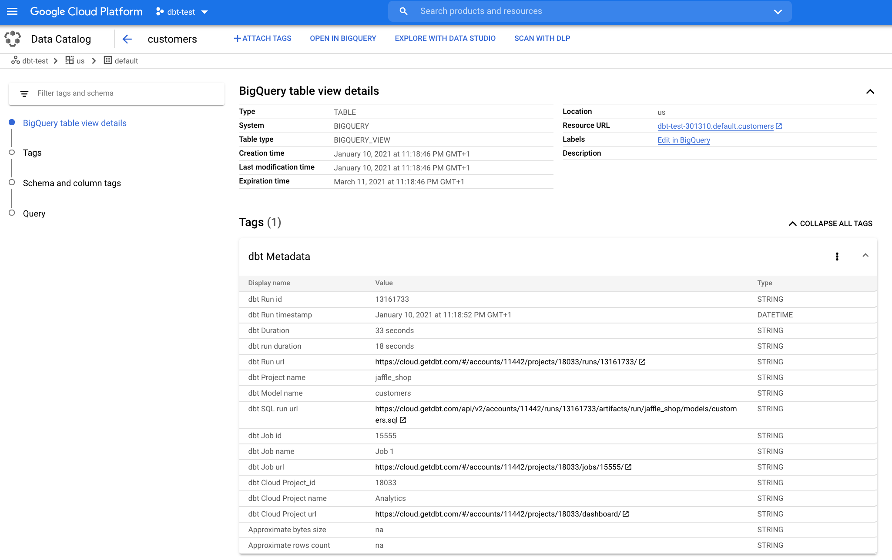

# dbt and Cloud dbt Tags


Create or update a [Google Cloud Data Catalog](https://cloud.google.com/data-catalog/) tag on BigQuery tables or views with [Cloud dbt](https://cloud.getdbt.com/) metadata via a Python [Cloud Function](https://cloud.google.com/functions).

Data Catalog tag : **[dbt Run Metadata](https://github.com/dbt-content/google-datacatalog-dbt-tag/blob/main/tag_template/dbt_metadata_tag_template.txt)** tag attached to the BigQuery table or view and containing information from the dbt Run used to create or update the BigQuery table or view : Run durations and date, dbt Project and Model names, Cloud job name and url, Cloud project name and url, approximative size and rows count.

To activate, learn and use Cloud Data Catalog, go to [https://cloud.google.com/data-catalog](https://cloud.google.com/data-catalog) and [https://console.cloud.google.com/datacatalog](https://console.cloud.google.com/datacatalog).

This repository contains the Cloud Function Python code to create or update the Data Catalog tag.

This Cloud Function uses:
- [Python Client for Google Cloud Data Catalog API](https://googleapis.dev/python/datacatalog/latest/index.html#)
- [Cloud dbt REST API](https://docs.getdbt.com/dbt-cloud/api/)

In your Cloud Function, you need the 5 files:
- [main.py](https://github.com/dbt-content/google-datacatalog-dbt-tag/blob/main/main.py)
- [config.py](https://github.com/dbt-content/google-datacatalog-dbt-tag/blob/main/config.py) where you need to update your **GCP project name** (where Tags Template are created) and the **[dbt Access Token](https://docs.trifacta.com/display/DP/Access+Tokens+Page)** (to use dbt API). You can also update the 2 tag templates ID if needed.
- [datacatalog_functions.py](https://github.com/dbt-content/google-datacatalog-dbt-tag/blob/main/datacatalog_functions.py)
- [dbt_metadata.py](https://github.com/dbt-content/google-datacatalog-dbt-tag/blob/main/dbt_metadata.py)
- [requirements.txt](https://github.com/dbt-content/google-datacatalog-dbt-tag/blob/main/requirements.txt)


Before runing the Cloud Function (and create or update tags), you need to create the Data Catalog Tag Template for [dbt Run Metadata](https://github.com/dbt-content/google-datacatalog-dbt-tag/blob/main/tag_template/dbt_metadata_tag_template.txt).

You can use:

- **Cloud Console** where you can [manage your Tag Templates](https://console.cloud.google.com/datacatalog?q=type%3DTAG_TEMPLATE)

- **gcloud** and the command `gcloud data-catalog tag-templates create`, full command lines in [gcloud_dbt_tag_template_create.sh](https://github.com/dbt-content/google-datacatalog-dbt-tag/blob/main/tag_template/gcloud_dbt_tag_template_create.sh), more details with and [example](https://cloud.google.com/data-catalog/docs/quickstart-tagging#data-catalog-quickstart-gcloud) and [reference](https://cloud.google.com/sdk/gcloud/reference/data-catalog/tag-templates/create). But be aware that with gcloud command line, you cannot manage template tag fields's order, fields will be in alphabetical order.

- **REST API** with the tag template json file [dbt_metadata_tag_template.json](https://github.com/dbt-content/google-datacatalog-dbt-tag/blob/main/tag_template/dbt_metadata_tag_template.json), more details with an [example](https://cloud.google.com/data-catalog/docs/quickstart-tagging#data-catalog-quickstart-drest) and [reference](https://cloud.google.com/data-catalog/docs/reference/rest/v1/projects.locations.tagTemplates/create).

To use the Cloud Function you just have to pass the dbt Cloud Run ID and the dbt Cloud Account ID in a JSON format like ```{"job_id":"7827359"}```.

When the Data Catalog template tag is created and when a tag is created or updated on BigQuery tables or views, you can find all results from [https://console.cloud.google.com/datacatalog](https://console.cloud.google.com/datacatalog).


Finally, you can also search BigQuery tables or views in Cloud Data Catalog with a dbt tag from your own application like [https://github.com/dbt-content/dbt-datacatalog-explorer](https://github.com/dbt-content/dbt-datacatalog-explorer)

<br>
Happy tagging !
<br><br><br>




